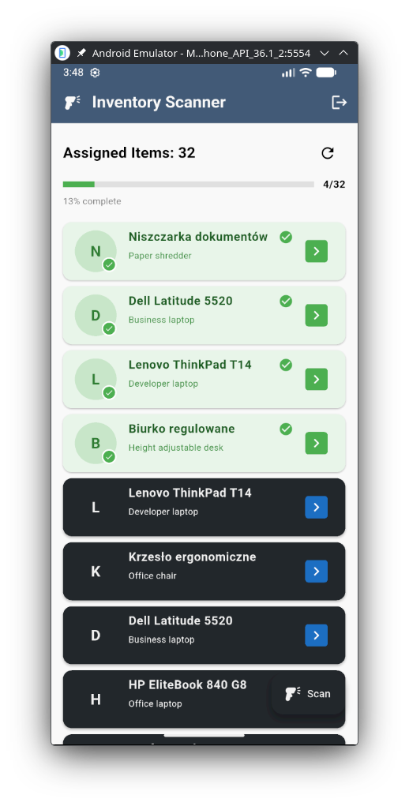
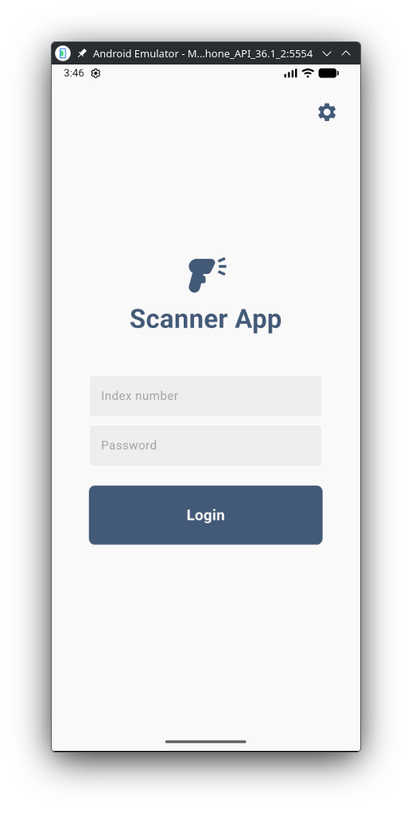
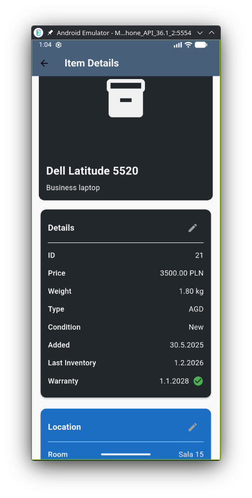
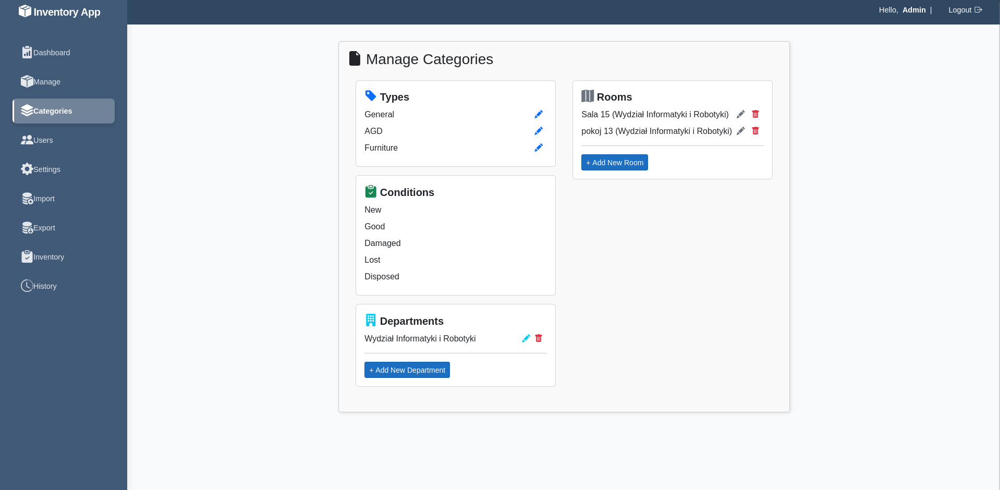
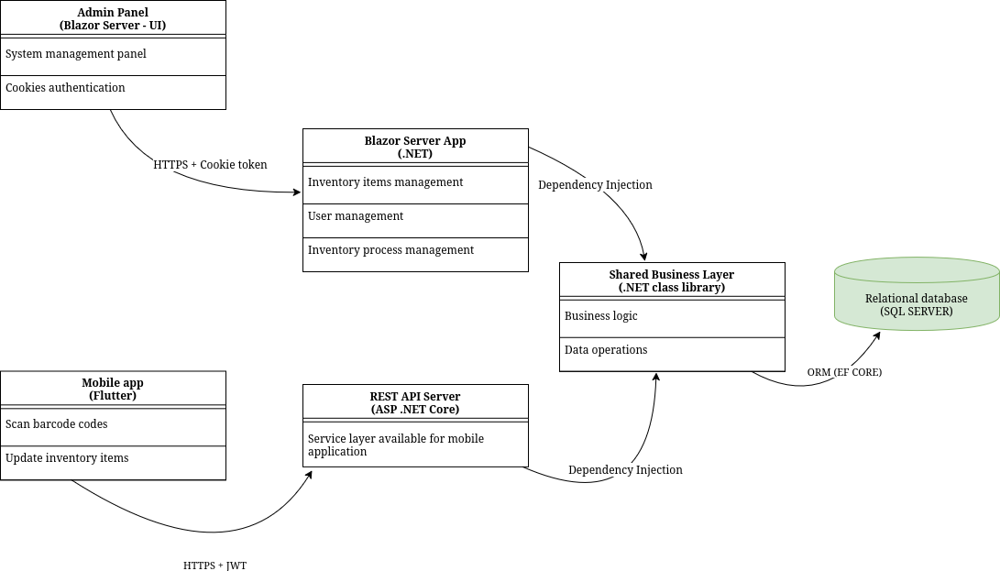

# Inventory System with Phone Scanning

This is a full-stack inventory management system that allows university administrators to scan barcode codes using a mobile app and manage inventory in real time through a web interface.

---
## 📸 Screenshots
<div style="display:flex; flex-flow:column; align-items:center;">
    <h3>Mobile app pages</h3>
    <div style="display:flex; justify-content:space-around; flex-flow:row;">
        
        
        
    </div>
    <h3>Home Page containing analytical data</h3>
    
    <br>
    <h3>Inventory management group list</h3>
    
    <br>
    <h3>Inventory management detail list</h3>
    
    <br>
    <h3>Inventory types management</h3>
    
    <br>
    <h3>Users management</h3>
    
    <br>
    <h3>Stocktake process management</h3>
    
    <br>
    <h3>Stocktake process details</h3>
    
    <br>
    <h3>System logs</h3>
    
</div>

---

## 🧩 Architecture Overview

The system consists of **4 independent components**:




All services are containerized and orchestrated using **Docker Compose**.

---

## 🚀 Tech Stack

| Layer | Technology |
|---|---|
| Backend API | C#, ASP.NET Core, Entity Framework Core |
| Web Frontend | ASP.NET Core (**Razor / MVC**) |
| Mobile App | Flutter (Dart) |
| Database | MS SQL Server |
| Shared Logic | C# Class Library (**InventoryLibrary**) containing micro-services |
| Unit Tests | xUnit |
| DevOps | Docker, Docker Compose |

---

## ✨ Features

- **Mobile scanning** — scan barcodes or QR codes using a smartphone camera via the Flutter app
- **Real-time sync** — scanned items are immediately reflected in the web interface via REST API calls
- **Inventory management** — add, update, and remove inventory items through the admin panel
- **Import and export** — import or export data to excel files
- **Manage users** — add, update or remove users through the admin panel
- **Analytics** — display analytical summaries for inventory items and inventory processes 
- **Unit tested** — business logic covered with xUnit tests
- **Docker** — entire stack runs with a single `docker compose up` command

---

## 📁 Project Structure

```
├── InventoryAPI/          # ASP.NET Core REST API
├── InventoryLibrary/      # Shared C# class library (models, interfaces, services)
├── Images                 # Folder containing preview images of items
├── InventoryWeb/          # Web frontend (ASP.NET Core Blazor)
├── MobileApp/             # Flutter mobile application
├── UnitTests/             # xUnit unit tests
├── compose.yaml           # Docker Compose configuration
└── Inventory System.sln   # Visual Studio solution file
```

---

## 🛠️ Getting Started

### Prerequisites

- [Docker](https://www.docker.com/) and Docker Compose
- [Flutter SDK](https://flutter.dev/) and [Android SDK](https://developer.android.com/studio) for mobile app emulation or an android device

### Run with Docker

```bash
git clone https://github.com/Juzix1/Inventory-system-with-phone-scanning.git
cd Inventory-system-with-phone-scanning
docker compose up --build
```

The API and web frontend will start automatically. The database is provisioned via Docker as well.

### Run Mobile App

```bash
cd MobileApp/inventory_app
flutter pub get
flutter run
```


---

## 🧪 Running Tests

```bash
cd UnitTests
dotnet test
```

---


## 📄 License

This project was created for educational purposes as part of a Computer Science engineering degree.
